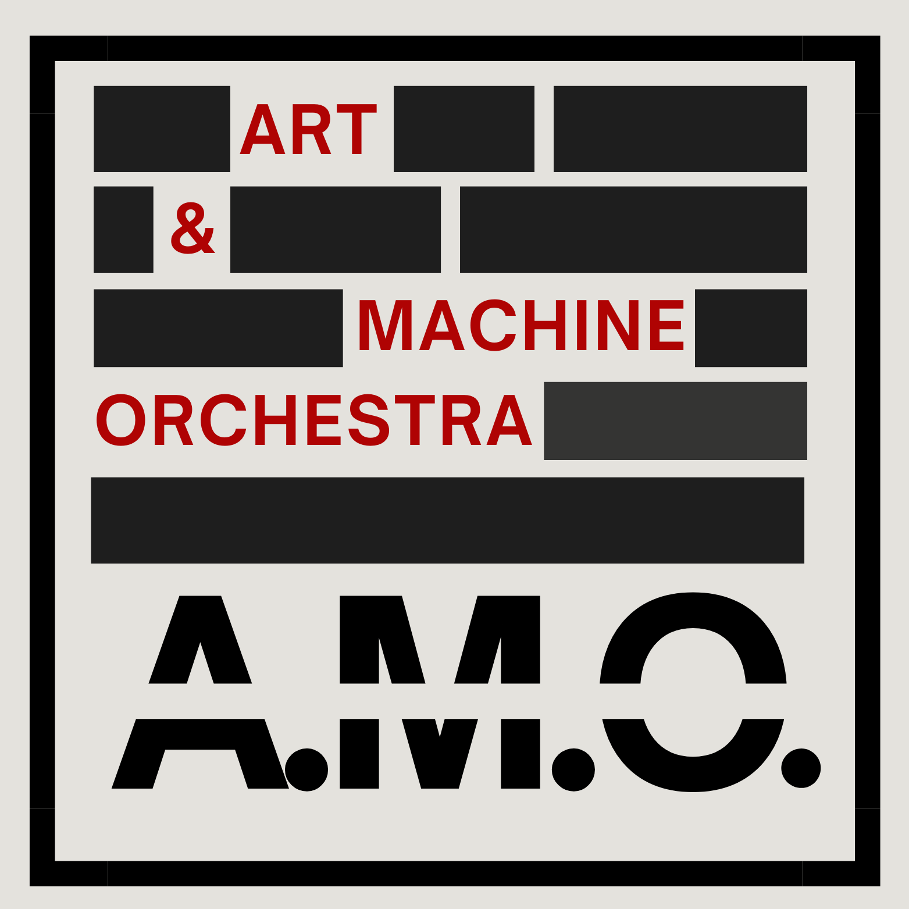

# AM Project
AI-driven automated marketing pipeline for generating brand-consistent fashion campaign content.

## Overview
The AM Project explores how structured AI pipelines can automate creative production
while maintaining brand identity and aesthetic coherence.

The system generates:
• product selections
• locations
• characters
• campaign imagery
• motion assets

## Key Technologies

AI Generation
- Seedream
- Nano Banana
- Veo 3
- Stable Diffusion

Automation
- n8n
- Airtable
- Cloudinary

Analytics
- campaign evaluation framework
- multi-dimensional scoring model

## Architecture

## Example Outputs

## Database
https://airtable.com/appsrSaXzDiVtH2TZ/tblnUODAapT1iq5l0/viwkNR3KVvEJItiHW?blocks=hide

## Research Context
This system was developed as part of a Bachelor thesis exploring
AI-driven marketing automation systems.
